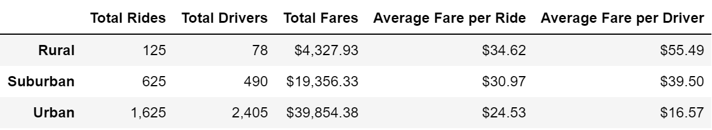
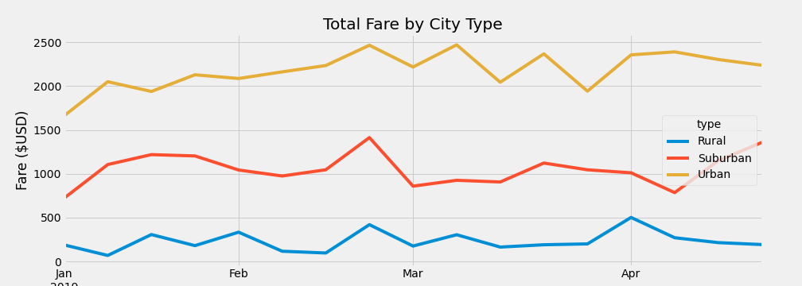

# PyBer-Analysis

## Project Overview

We have been tasked with using the Pandas and Matplotlib libraries to perform analysis and visualization for a ridesharing company, PyBer. The ridesharing data needs to be split by city type (urban, suburban, or rural). We need to determine the total rides, total drivers, total fares, and average fares by ride/driver and create a new DataFrame for these summary statistics. We also need to plot the total weekly fares for each city type on a line graph.

## Results

As seen above, there are some stark differences between the three city types. Urban cities have by far the highest total rides, drivers, and fares. Meanwhile, rural areas have the highest average fare per ride and average fare per driver. This is intuitive because there are fewer drivers in rural areas so they likely charge much more. Rides in rural areas are also probably longer on average.

This line graph shows the total fares for each city type for every week in January through April.

## Summary

